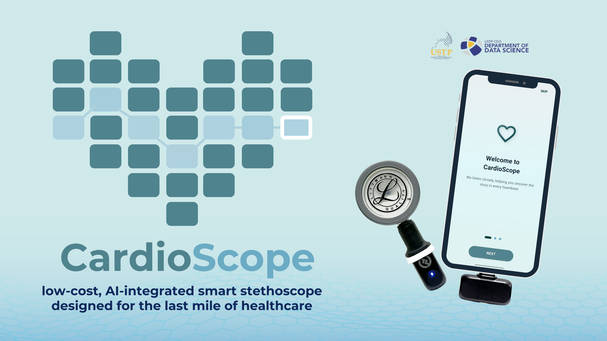
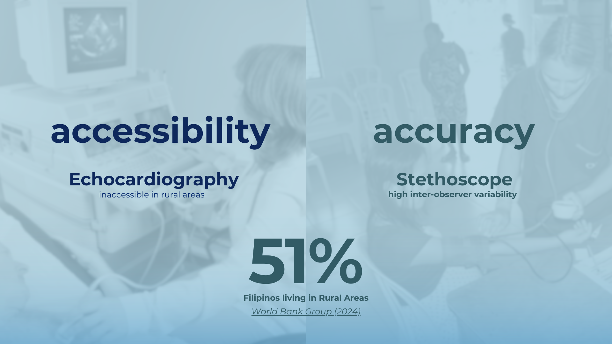
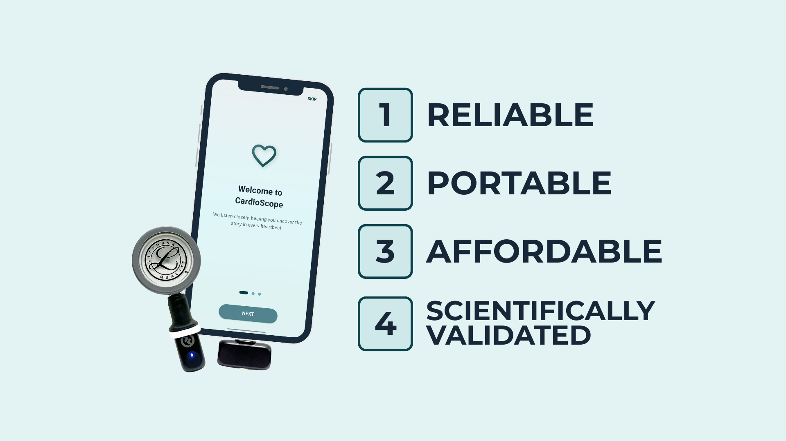
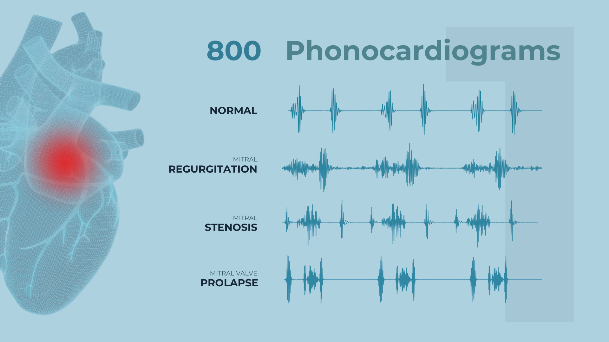
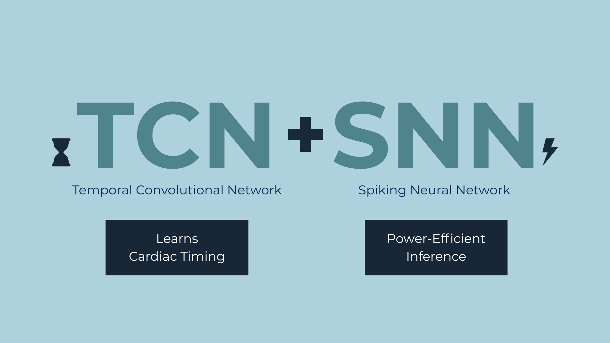
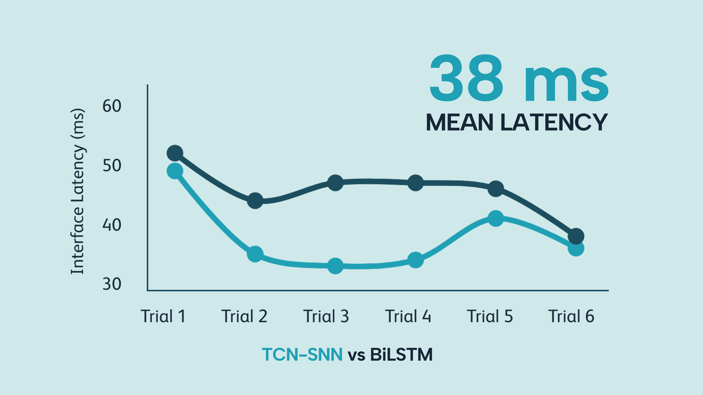
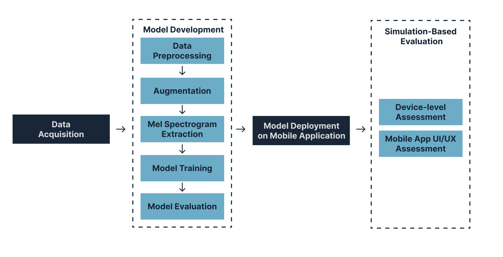
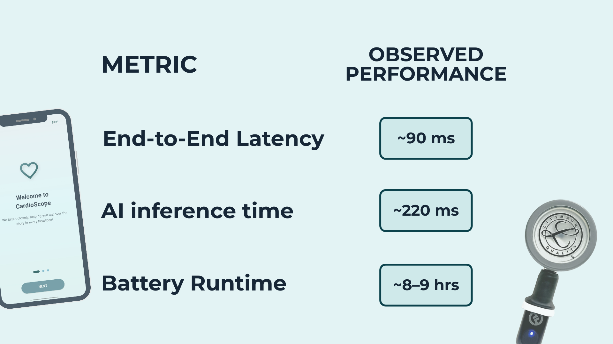
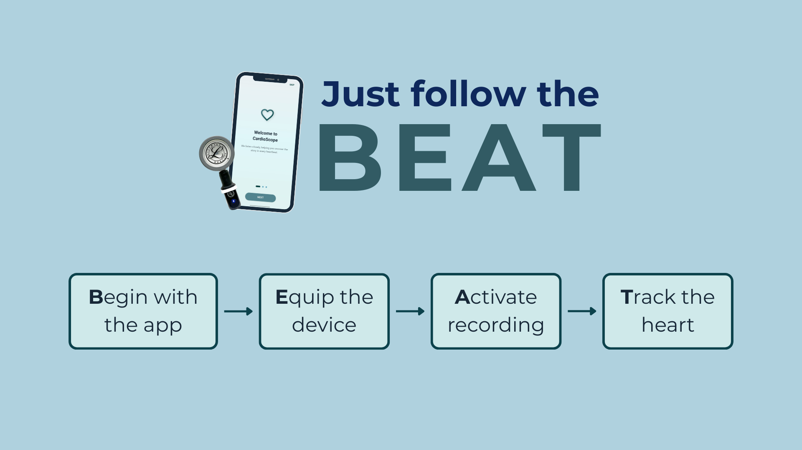

<!-- ================= HERO / LANDING ================= -->

  

  <strong>AI-Assisted Wireless Stethoscope for Non-Invasive Heart Disease Screening</strong>

  
  
  
  
  

---

<!-- ================= PROBLEM ================= -->

<h2 align="center">The Problem</h2>

  

  

  

  <em>Early cardiac screening is limited by access, cost, and specialist availability.</em>

---

<!-- ================= SYSTEM ================= -->

<h2 align="center">The Solution</h2>

  

  

  <em>CardioScope integrates hardware, mobile software, and on-device AI.</em>

---

<!-- ================= DATA ================= -->

<h2 align="center">Clinical Data</h2>

  

  

  <em>Validated phonocardiogram recordings reviewed by medical experts.</em>

---
<!-- ================= DATA ACCESS ================= -->

<h2 align="center">Dataset Access</h2>

  Due to file size limits and data governance considerations,
  the full CardioScope dataset is hosted externally.

  <a href="https://drive.google.com/drive/folders/1w_TKrdESWz-XGh7LZr5CQdL1MFQ_aOaH?usp=sharing">
    Access the CardioScope Dataset
  </a>

  <em>
    The repository includes complete preprocessing, training,
    and evaluation pipelines for reproducible experiments.
  </em>

---
<!-- ================= AI ================= -->

<h2 align="center">AI Engine</h2>

  

  

  

  <em>Temporal deep learning optimized for heart sound analysis.</em>

---

<!-- ================= PIPELINE ================= -->

<h2 align="center">Workflow</h2>

  

---

<!-- ================= HARDWARE ================= -->

<h2 align="center">Hardware Prototype</h2>

  

  

---

<!-- ================= UX ================= -->

<h2 align="center">User Experience</h2>

  

  

  <em>Simple, guided workflow for screening and reporting.</em>

---

<!-- ================= DEFENSE ================= -->

<h2 align="center">Project Materials</h2>

  <a href="docs/slides/Final%20Defense.pdf">Final Defense Slides (PDF)</a> ·
  <a href="docs/slides/USTP-CardioScope.pdf">USTP CardioScope Slides (PDF)</a> ·
  <a href="docs\CARDIOSCOPE - FINAL PAPER.pdf">CardioScope Final Paper (PDF)</a>

---
<!-- ================= REPOSITORY STRUCTURE ================= -->

<h2 align="center">Repository Structure</h2>

<pre>
cardioscope_app/
├── ai_pipeline/                # AI research and model development
│
├── app/                        # Flutter mobile application (production)
│
├── docs/                       # Documentation and project media
│
├── CITATION.cff                # Academic citation metadata
├── LICENSE.md                  # MIT License
└── README.md                   # Project homepage (this file)
</pre>

  <em>
    The repository separates production code, AI research, and documentation
    to ensure clarity, reproducibility, and ethical compliance.
  </em>

---
<!-- ================= FOOTER ================= -->

  <strong>University of Science and Technology of Southern Philippines</strong> 
  Research & Capstone Project · 2025

  <a href="LICENSE">MIT License</a> · <a href="CITATION.cff">Citation</a>

