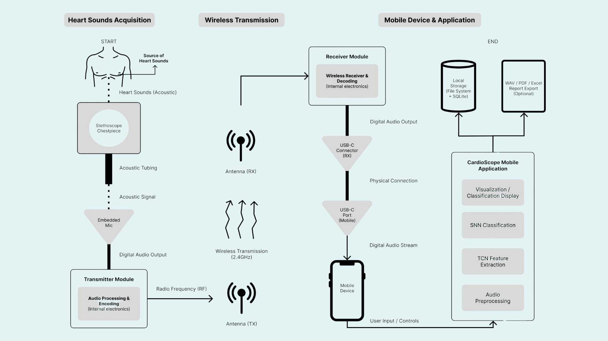

# CardioScope  
**A Deep Learning–Integrated Wireless Stethoscope for Non-Invasive Heart Disease Screening**


---

## Overview

**CardioScope** is a mobile-based assistive system designed to support **non-invasive cardiac screening** through automated analysis of heart auscultation sounds.  
The system integrates a **custom wireless stethoscope**, a **Flutter mobile application**, and **temporal deep learning models** to analyze phonocardiogram (PCG) signals and identify patterns associated with mitral valve abnormalities.

CardioScope is intended as a **clinical decision-support and screening tool**, not as a replacement for professional medical diagnosis.

This project was developed as a capstone and research initiative at the **University of Science and Technology of Southern Philippines (USTP)**.

---

## System Architecture

The CardioScope system consists of three main layers:

1. **Hardware Layer**  
   - Custom-built electronic stethoscope
   - Electret microphone with acoustic chamber
   - 2.4 GHz wireless transmission module
   - Battery-powered portable design

2. **Mobile Application Layer**  
   - Flutter-based cross-platform mobile app
   - Real-time recording and playback of heart sounds
   - Secure local storage with anonymized backups
   - PDF and Excel report generation

3. **AI Inference Layer**  
   - Preprocessing pipeline for mel-spectrogram generation
   - Temporal deep learning models deployed via TensorFlow Lite
   - Low-latency on-device inference

<p align="center">
  
</p>

---

## AI Model Architecture

CardioScope employs **temporal deep learning architectures** optimized for auscultation signals:

- **Temporal Convolutional Network (TCN)**
- **Hybrid TCN–Spiking Neural Network (TCN–SNN)**

The hybrid architecture leverages:
- Dilated temporal convolutions for long-range dependency modeling
- Parametric spiking neurons for temporal sparsity
- Attention-based classification head

<p align="center">
  
</p>

---

## Mobile Application Interface

The CardioScope mobile application provides an end-to-end workflow for clinicians and health workers:

- Guided recording of heart sounds
- Real-time waveform visualization
- Automated classification results
- Patient record management
- Report generation and export

<p align="center">
  
</p>

---

## Demonstration

Sample demonstrations of the CardioScope system are provided below:

- **Mobile Application Demo**  
  `docs/demo/app_demo.gif`

- **Hardware Recording Demo**  
  `docs/demo/device_demo.gif`

These demonstrations illustrate the recording process, AI inference flow, and report generation.

---

## Defense and Presentation Materials

The official project defense materials are available below:

- **Final Defense Slides**  
  [Final Defense Presentation (PDF)](docs/slides/Final%20Defense.pdf)

- **USTP CardioScope Slides**  
  [USTP CardioScope Presentation (PDF)](docs/slides/USTP-CardioScope.pdf)

These files are stored using **Git Large File Storage (LFS)** and are accessible directly through GitHub.

---

## Repository Structure

```
cardioscope_app/
├── app/            # Flutter application source code
├── docs/           # Images, demos, and presentation slides
├── paper/          # Final research manuscript
├── hardware/       # Device design and bill of materials
├── ethics/         # Ethics clearance and validation documents
├── CITATION.cff    # Citation metadata
└── README.md       # Project documentation
```

---

## Ethics and Compliance

This project complies with ethical research standards for health-related data:

- Patient data are anonymized
- Audio recordings are stored locally
- Explicit consent procedures are followed
- Ethics clearance documents are included in the repository

CardioScope is intended strictly for **assistive screening and research purposes**.

---

## Citation

If you use CardioScope or its components in academic work, please cite using the metadata provided in [CITATION](CITATION.cff)

You may also cite the project as:

> CardioScope: A Deep Learning–Integrated Device for Non-Invasive Heart Disease Detection via Cardiac Sound Analysis.  
> University of Science and Technology of Southern Philippines, 2025.

---

## Authors

Authors are listed in **alphabetical order**:

- Genheylou Deligero Felisilda  
- Nicole Suerte Menorias  
- Kobe Marco Gamus Olaguir  
- Joanna Reyda D. Santos  

---

## License

This project is licensed under the **MIT License**.  
See the [LICENSE](LICENSE) file for details.

---

## Disclaimer

CardioScope is a research and assistive tool.  
It is **not a medical diagnostic device** and should not be used as a substitute for professional clinical judgment.
